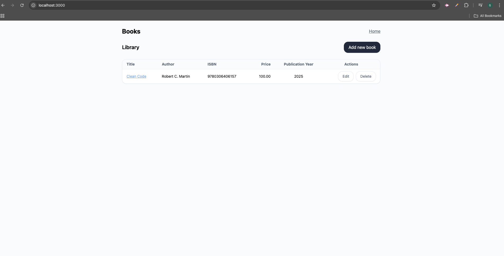
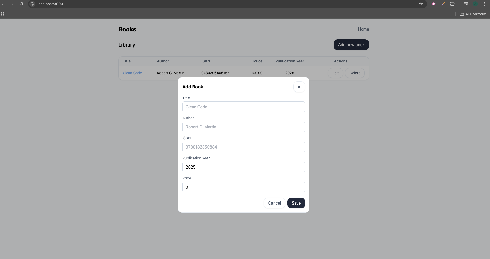
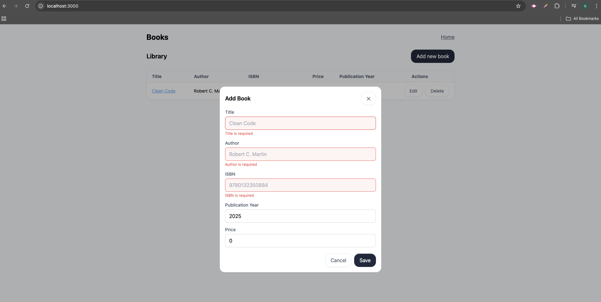
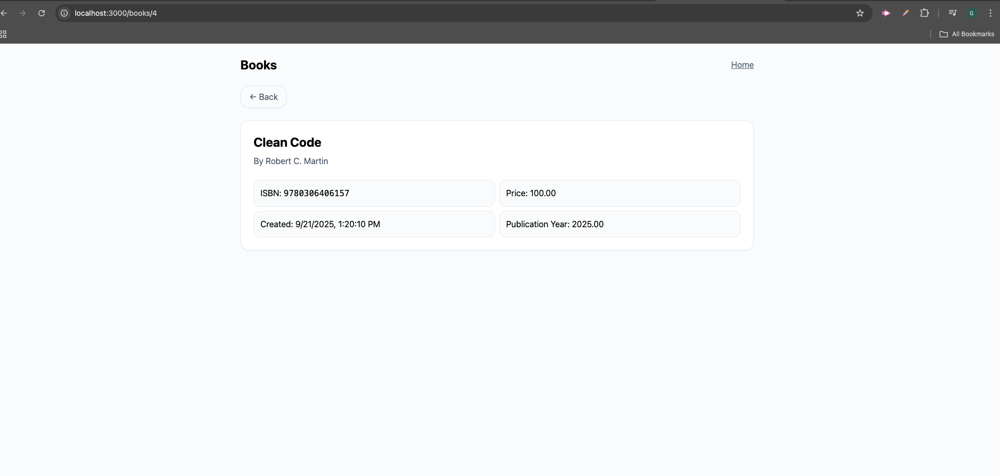
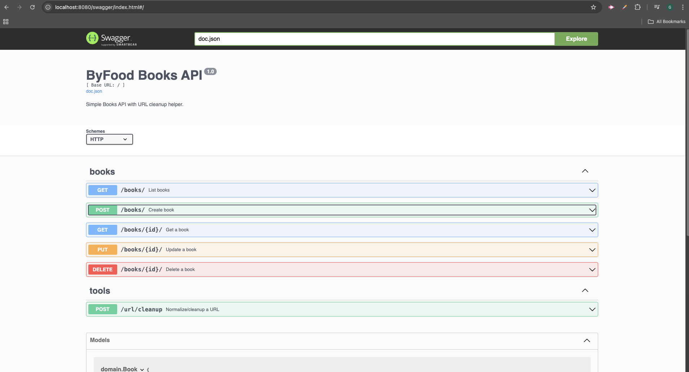
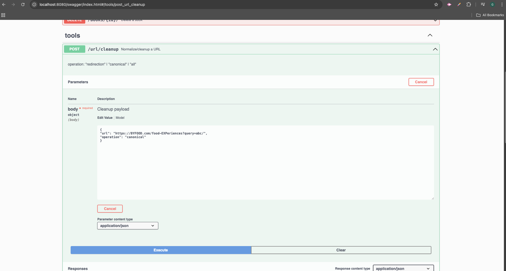
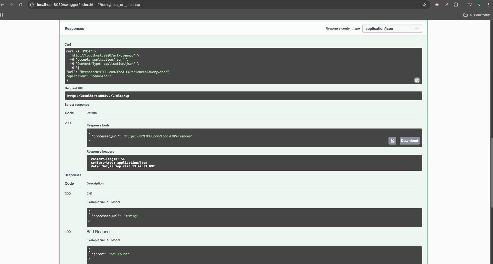

# ByFood Books API

A Go + Next.js with Swagger docs to handle Books CRUD & URL Cleanup.

---

## 📦 Prerequisites

- Docker Desktop (or Docker Engine + Compose v2)
- npm install -g pnpm (if you don't have pnpm installed globally)

---

## Installation

1. go to backend folder execute `docker-compose up --build` this will create app docker instance running in localhost:8080
2. go to frontend folder execute `pnpm install` and then followed with `pnpm dev` this will let the app frontend run in localhost:3000

## Swagger Documentation 

Swagger documentation for endpoint usage example can be accessed at [http://localhost:8080/swagger/index.html](http://localhost:8080/swagger/index.html). Updating swagger documenation can be done through command `swag init -g ./cmd/api/main.go -o ./docs`

## Unit Test Execution

To execute unit test in backend, please go to backend folder then execute command `go test ./...` this will test entire unit test file.

## Screenshots of working application

Listing Books


Create New Book


Input Validation


View Book Detail


Swagger Documentation


Cleanup Url Using Swagger


Cleanup Url Result Through Swagger


## Backend Project Structure

```text
.
├─ cmd/api
│  └─ main.go
├─ docs/
│  └─ docs.go                       # Swagger documentation
│  └─ swagger.json
│  └─ swagger.yaml
├─ internal/                        # Hexagonal Architecture
│  ├─ adapters/
│  │  ├─ http/
│  │  │  └─ handler.go              # request handler
│  │  └─ mysql/
│  │     └─ book_repository.go      # repository for books
│  ├─ app/
│  │  └─ book_service.go            # book service application layer
│  │  └─ validation.go              # service for validation
│  ├─ domain/
│  │   └─ book.go                   # model is placed here
│  ├─ logger/
│  │   └─ logger.go                 # logger helper
│  └─ ports/                        # interfaces files
├─ migrations/                      # SQL init files
├─ go.mod / go.sum
├─ Dockerfile
└─ docker-compose.yml
```
